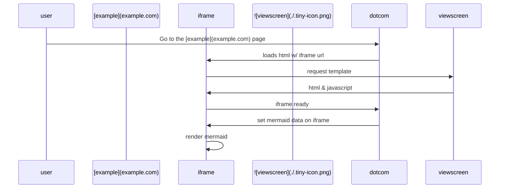

# papers
All my papers

```mermaid
sequenceDiagram
    participant user
    participant [example](example.com)
    participant iframe
    participant ![viewscreen](./.tiny-icon.png)
    user->>dotcom: Go to the [example](example.com) page
    dotcom->>iframe: loads html w/ iframe url
    iframe->>viewscreen: request template
    viewscreen->>iframe: html & javascript
    iframe->>dotcom: iframe ready
    dotcom->>iframe: set mermaid data on iframe
    iframe->>iframe: render mermaid
```
