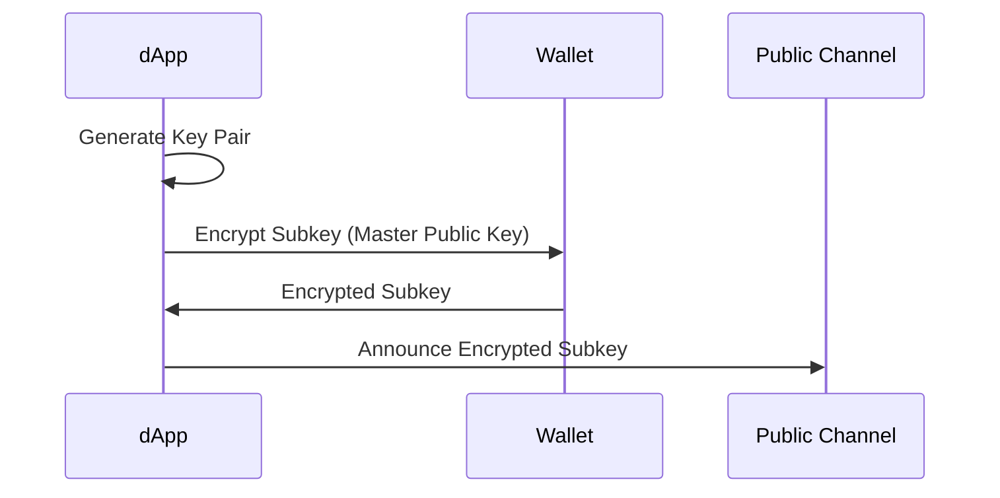
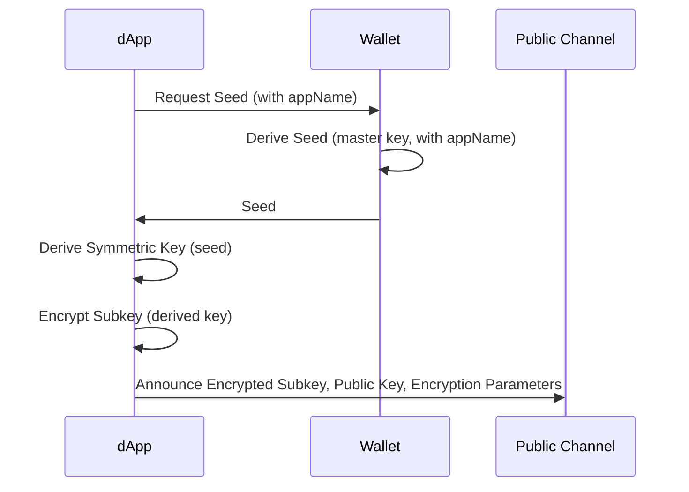

# Cryptographic Subkeys in Decentralized Applications
Authors: Nik Rykov <nik@pentachoron.tech>

License: CC0 Public domain

05.30.2023

## 1. Introduction

This specification outlines a methodology for enhancing security, user experience, and flexibility in interactions between decentralized applications (dApps) and users by utilizing cryptographic subkeys. Traditionally, a single cryptographic key is used for various operations such as spending currency, encryption/decryption, and smart contract interactions. This document proposes a system where each dApp is granted its own subkey derived from the user's master key, thus separating the concerns and enhancing overall security without compromising usability.

## 2. Motivation

The primary motivations for this approach include:
- **Enhanced Security**: By isolating the keys used by different dApps, the impact of a security breach in one dApp is limited to that dApp only.
- **Improved User Experience**: Users can interact with dApps without repeatedly approving actions through their wallet provider, streamlining the process.
- **Increased Flexibility**: This method is adaptable to various cryptographic key systems, including those that do not natively support encryption.

## 3. Requirements

The implementation of this system must fulfill two core requirements:
- The master key system must support either direct encryption/decryption capabilities or allow for arbitrary data derivation using a secret base (e.g., using hash functions like Argon2 for key derivation).

## 4. Implementation

### 4.1. Scenario A: Master Key with Encryption/Decryption Support

#### 4.1.1. Subkey Creation

1. **Generate Subkey Pair**: The dApp generates a random key pair.
2. **Encrypt Subkey**: The dApp requests the wallet provider to encrypt the subkey's private key using the master public key.
3. **Announce Subkey**: The encrypted subkey and its public part are announced on a public channel for recovery and profile linking across dApps.

#### 4.1.2. Subkey Recovery

1. **Fetch Announced Data**: The dApp retrieves the encrypted subkey and its public part.
2. **Decrypt Subkey**: The dApp requests the wallet provider to decrypt the subkey's private key using the master private key.

#### 4.1.3. Pseudocode Example

```plaintext
function createSubkey(masterPublicKey):
    subkeyPair = generateKeyPair()
    encryptedSubkey = encryptWithPublicKey(subkeyPair.private, masterPublicKey)
    announce(encryptedSubkey, subkeyPair.public)

function recoverSubkey(encryptedSubkey, masterPrivateKey):
    subkeyPrivate = decryptWithPrivateKey(encryptedSubkey, masterPrivateKey)
    return subkeyPrivate
```
#### 4.1.4 Sequence diagram



### 4.2. Scenario B: Arbitrary Data Derivation

#### 4.2.1. Subkey Creation

1. **Generate Subkey Pair**: Similar to Scenario A, a subkey pair is generated for dedicated use by a dApp.
2. **Derive Symmetric Key**: Utilize a hashing function (e.g., Argon2) with the master key and a unique identifier (e.g., dApp name) to derive a symmetric encryption key. Often, access to signature function is provided. It can act as such a hash function (with master key parameter passed by default) as long as it's deterministic.
3. **Encrypt Subkey**: Encrypt the subkey's private key using the derived symmetric key.
4. **Announce Subkey**: The encrypted subkey, its public part, and necessary encryption parameters (e.g., salt, IV) are announced on a public channel for recovery and profile linking across dApps.

#### 4.2.2. Subkey Recovery

1. **Fetch Announced Data**: Similar to Scenario A.
2. **Derive Symmetric Key**: Derive the symmetric encryption key using the same process as during creation.
3. **Decrypt Subkey**: Decrypt the subkey's private key using the derived symmetric key.

#### 4.2.3. Pseudocode Example

```plaintext
function createSubkey(masterKey, appName):
    subkeyPair = generateKeyPair()
    derivedKey = deriveKey(masterKey, appName) // or signature(appName)
    encryptedSubkey = encryptWithDerivedKey(subkeyPair.private, derivedKey)
    announce(encryptedSubkey, subkeyPair.public, derivedKeyParams)

function recoverSubkey(encryptedSubkey, masterKey, appName):
    derivedKey = deriveKey(masterKey, appName) // or signature(appName)
    subkeyPrivate = decryptWithDerivedKey(encryptedSubkey, derivedKey)
    return subkeyPrivate
```

#### 4.2.3. Sequence diagram



## 5. Terminology

- **dApp**: Decentralized application requiring cryptographic operations.
- **Master Key**: The primary cryptographic keypair used by the user for dApp interactions.
- **Subkey**: A cryptographic keypair, derived from the master key, dedicated to a specific dApp.
- **User**: The entity utilizing the dApp through a master key.
